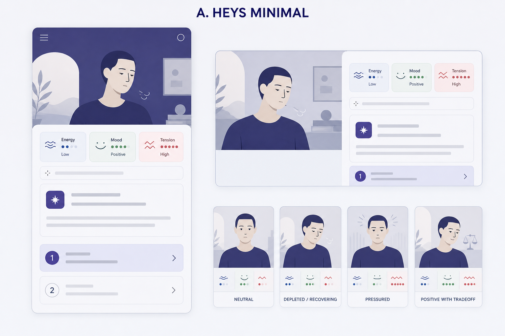
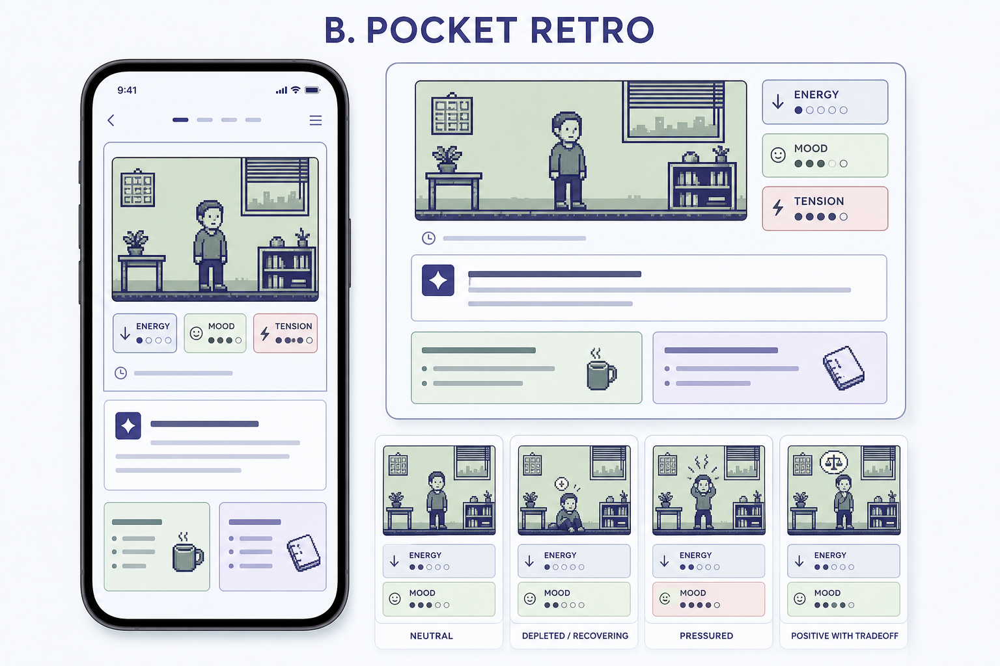
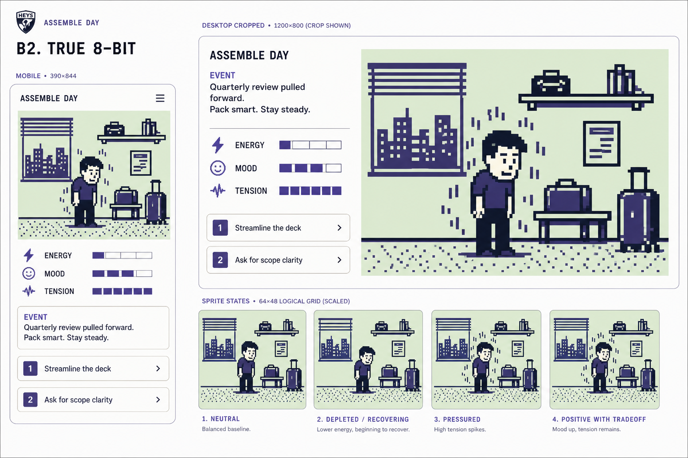
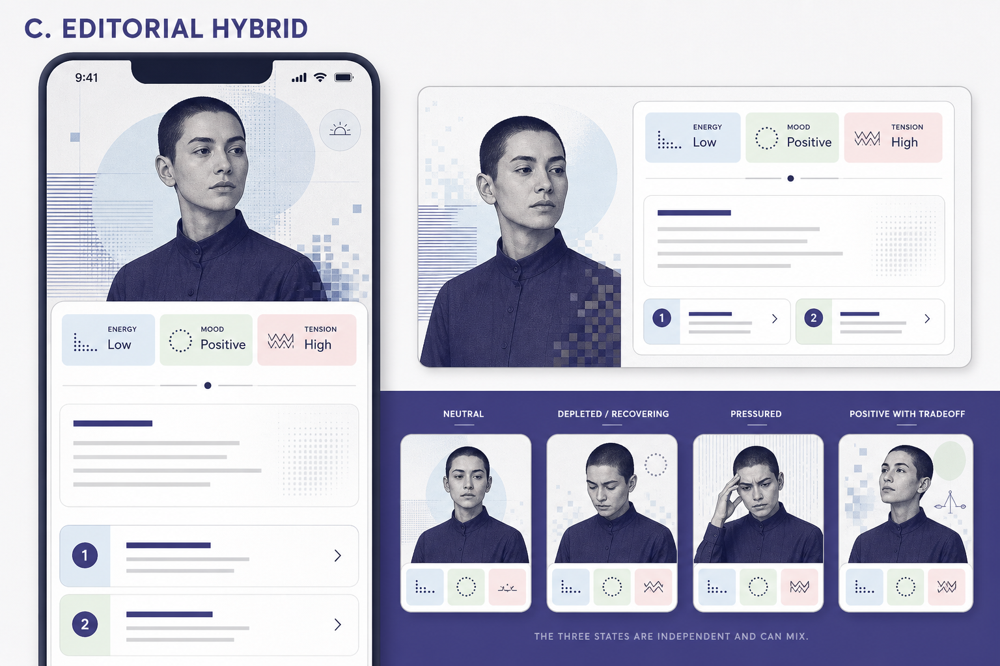

# Visual V1 — концепция визуального слоя персонажа

Дата: 2026-07-30

Статус: `DONE — Concept B selected; owner-resolution accepted 2026-07-30`

Scope: concept-only. Production UI, engine, reducer, balance, persistence,
bundles, D2/D3/D32 и core-спринты не менялись.

## Решение

Владелец выбрал направление **B — Pocket Retro / HEYS Shell**:

- спокойная low-color pixel-сцена с персонажем и небольшим окружением;
- взрослый нейтральный персонаж без питомца, toy shell и nostalgia gimmicks;
- сцена остаётся маленькой частью текущей HEYS-карточки, а не отдельным
  полноэкранным «тамагочи»;
- энергия, настроение и напряжение остаются независимыми текстовыми indicators;
- поза, лицо и ambient pattern только дублируют engine-owned qualitative state
  другим каналом и меняются после успешного reducer-step.

Выбранный visual north star — файл `02a-pocket-retro-first-pass.png`;
приложенный владельцем исходник подтверждён тем же SHA-256. Более жёсткая
B2-итерация остаётся только evidence эксперимента.

Owner-resolution принята прямой командой владельца 2026-07-30: D2 разрешает
заменить статический силуэт функциональной Pocket Retro-сценой, а D32 получает
узкое исключение только для character state layer. Кроме того, V0-gap с
engine-owned live presentation selector должен быть закрыт в V2 до подключения
scene к UI.

## Baseline и ограничения проверки

Текущий production baseline — компактная карточка с абстрактным статическим
силуэтом `74×86`, ролью/семьёй и тремя indicators. На desktop карточка занимает
левый rail, а развилка — правую колонку; на mobile status cards остаются в одной
строке (`apps/web/assemble-day/heys_assemble_day_game_v1.ts:605-633`,
`apps/web/styles/modules/912-planning-game-assemble-day.css:73-133,379-410`).

Локальный `pnpm dev:local` был поднят и открыл `localhost:3001`, но корень
показал client login. В этой concept-сессии личные/production credentials не
использовались, поэтому новый runtime screenshot самой игры не снимался. Для
layout baseline использованы текущий source contract, требование 390×844 из
`06_UI_UX.md:173-182` и последний зафиксированный Sprint 5 browser evidence в
мегаплане. Это S3-ограничение concept evidence, не разрешение пропустить
обязательный V2 browser smoke.

Concept boards созданы встроенным `image_gen`. Они показывают art direction и
state contrast, но не являются runtime assets: сгенерированные hardware frames,
английский copy, лица и выдуманные логотипы не переносятся в production.

## Facts Table

| Claim                                                          | Source                                 | Verify command                                                                                                                                                                                 | Result                                                                                                                                                                                                                       |
| -------------------------------------------------------------- | -------------------------------------- | ---------------------------------------------------------------------------------------------------------------------------------------------------------------------------------------------- | ---------------------------------------------------------------------------------------------------------------------------------------------------------------------------------------------------------------------------- | ----------------------------------------------------------- | ----------------------------------------- |
| Visual V0 завершён без S1 и запрещает общий health score       | V0 report                              | `sed -n '1,35p;98,119p' docs/assemble-day/reports/visual-character-audit-v0.1.md`                                                                                                              | ✅ `DONE`; independent axes, no common score                                                                                                                                                                                 |
| Текущий UI использует статический silhouette и три state pills | Direct source                          | `sed -n '605,633p' apps/web/assemble-day/heys_assemble_day_game_v1.ts`                                                                                                                         | ✅ `Silhouette`, `CharacterCard`, 3× `StatusPill`                                                                                                                                                                            |
| Mobile/desktop placement уже задан CSS                         | Direct source                          | `sed -n '73,133p;379,410p' apps/web/styles/modules/912-planning-game-assemble-day.css`                                                                                                         | ✅ `74×86`, desktop left rail, mobile rules                                                                                                                                                                                  |
| D2 отделяет indicators от абстрактного портрета                | Decision register                      | `sed -n '130,147p' docs/assemble-day/10_DECISION_REGISTER.md`                                                                                                                                  | ✅ abstract silhouette; D3 not portrait                                                                                                                                                                                      |
| D3 сохраняет energy/mood/tension отдельными                    | Decision register                      | `sed -n '150,164p' docs/assemble-day/10_DECISION_REGISTER.md`                                                                                                                                  | ✅ three independent indicators; common wellbeing rejected                                                                                                                                                                   |
| D32 отклоняет cartoon styling                                  | Decision register                      | `sed -n '779,802p' docs/assemble-day/10_DECISION_REGISTER.md`                                                                                                                                  | ✅ cartoon styling explicitly rejected                                                                                                                                                                                       |
| Все concept boards имеют 1536×1024 и сохранённый SHA-256       | Generated assets                       | `sips -g pixelWidth -g pixelHeight docs/assemble-day/reports/assets/visual-character-concept-v0.1/*.png && shasum -a 256 docs/assemble-day/reports/assets/visual-character-concept-v0.1/*.png` | ✅ 4× `1536×1024`; hashes match manifest                                                                                                                                                                                     |
| Владелец выбрал Concept B после сравнения с B2                 | Owner feedback persisted in provenance | `rg -n "выбрал исходный Concept B                                                                                                                                                              | visual north star" docs/assemble-day/reports/assets/visual-character-concept-v0.1/prompts-and-provenance.md && shasum -a 256 docs/assemble-day/reports/assets/visual-character-concept-v0.1/02a-pocket-retro-first-pass.png` | ✅ выбор записан; asset `0282dc3b...b1210578d`              |
| Runtime root доступен, но игра закрыта client login            | Current Playwright snapshot            | `rg -n "Вход клиента                                                                                                                                                                           | Телефон                                                                                                                                                                                                                      | PIN-код" .playwright-cli/page-2026-07-30T08-38-18-202Z.yml` | ✅ login fields present; game not reached |

## Три концепции

### A — HEYS-native premium minimal



Сильные стороны:

- максимально совместим с D2/D32 и текущей карточкой;
- взрослый, спокойный и легко вписывается в HEYS;
- хорошая mobile density и низкая техническая цена.

Слабые стороны:

- это качественная иллюстрация с pixel accents, а не 8-bit system;
- mixed state читается в основном через status cards, не через героя;
- почти не создаёт новой игровой идентичности.

Вердикт: безопасный fallback, но не решает поставленную эмоциональную задачу.

### B — Pocket Retro

Первая итерация сохранила правильный баланс: игровая сцена заметна, но не
вытесняет решение; pixel language достаточно выразителен без ощущения грубой
аркадной стилизации. После прямого сравнения владелец выбрал именно этот board.



В B2 grid и palette были намеренно усилены для проверки буквального 8-bit:



Почему выбран B:

- персонаж и окружение воспринимаются как единая небольшая игровая сцена;
- low energy, positive mood и high tension могут сосуществовать;
- стиль мягче и лучше сочетается с премиальным HEYS shell;
- запоминающаяся собственная идентичность игры.

Почему B2 отклонён:

- более крупный и жёсткий pixel language выглядит грубее и сильнее спорит с HEYS
  shell;
- сцена и вспомогательные элементы занимают слишком много места;
- неканоничный shield logo и английский copy усиливают ощущение отдельной игры,
  а не встроенного режима HEYS.

Ограничения выбранного B: телефонная рамка, английский copy и сгенерированные
иконки не являются частью концепции; production получает только компактную
pixel-сцену внутри существующего HEYS shell.

Вердикт: **Concept B выбран владельцем**; реализация возможна после
owner-resolution.

### C — Hybrid editorial



Сильные стороны:

- наиболее взрослая и эмоционально точная подача;
- состояния хорошо различаются без цвета;
- сильный premium/editorial характер.

Слабые стороны:

- конкретный портрет создаёт ненужную демографическую идентичность;
- photo/portrait asset дороже, тяжелее и хуже подходит canonical fixed-neutral
  character;
- 8-bit остаётся halftone-декором;
- portrait доминирует над развилкой и плохо масштабируется в компактный rail.

Вердикт: отклонить для текущей игры; сохранить как референс взрослой
эмоциональной сдержанности.

## Decision matrix

Шкала `1–5`, где `5` — лучший результат. Числовая сумма не выбирает победителя
автоматически: после таблицы применены product veto.

| Критерий                                 | A Minimal | B Pocket Retro | B2 True 8-bit | C Editorial |
| ---------------------------------------- | --------: | -------------: | ------------: | ----------: |
| Понятность текущего состояния            |         4 |              4 |             4 |           5 |
| Совместимость с D2/D3/D32 без resolution |         5 |              3 |             2 |           2 |
| HEYS brand fit                           |         5 |              5 |             4 |           4 |
| Взрослая тональность                     |         5 |              4 |             4 |           5 |
| Различимость без цвета/анимации          |         4 |              4 |             5 |           5 |
| Mobile density                           |         4 |              4 |             3 |           2 |
| Originality / IP safety                  |         5 |              4 |             4 |           3 |
| Техническая цена                         |         5 |              4 |             5 |           2 |
| Выразительный pixel-язык                 |         1 |              4 |             5 |           1 |
| **Сумма / 45**                           |    **38** |         **36** |        **36** |      **29** |

Veto:

- A набирает больше баллов, но почти не добавляет игре собственной визуальной
  идентичности;
- C создаёт portrait/asset/privacy burden и вытесняет decision content;
- B2 формально сильнее по pixel-языку, но выглядит грубее и хуже сохраняет
  спокойный HEYS-контекст;
- B даёт нужное ощущение игры без чрезмерной аркадности; окончательный выбор
  подтверждён владельцем, а не арифметической суммой.

Поэтому выбирается **B**, но строго внутри layout shell A.

## Implementation-ready specification

### Layout

Production UI не повторяет крупную сцену concept board.

| Surface         | Scene                                               | Поведение                                                                                                                                      |
| --------------- | --------------------------------------------------- | ---------------------------------------------------------------------------------------------------------------------------------------------- |
| Mobile 390×844  | SVG `viewBox="0 0 56 48"`, rendered `112×96 CSS px` | Заменяет текущий `74×86` silhouette в CharacterCard; copy остаётся справа, три pills — ниже. Общая прибавка высоты карточки не более 10–16 px. |
| Desktop         | Те же `112×96 CSS px`                               | Остаётся в левом rail; не растягивается в banner.                                                                                              |
| Result beat     | Та же scene после committed state                   | Result text остаётся главным; visual говорит «состояние сейчас», а не присваивает всю причинность action.                                      |
| Week/Month/Life | Нет постоянной scene                                | Только second-layer disclosure, если V2 подтвердит необходимость.                                                                              |

На mobile после CharacterCard остаются видимы situation и начало options в
границах текущего requirement 390×844. Если V2 screenshot этого не доказывает,
scene уменьшается до `96×82`, а не вытесняет decision content.

### Pixel system

- logical grid: `56×48`;
- render scale: `2×` CSS pixels;
- adult sprite envelope: `14–16 × 22–24` logical pixels;
- основные sprite-контуры строятся на целых logical pixels; мягкость достигается
  композицией и палитрой, а не blur или raster-фильтрами;
- `shape-rendering: crispEdges`; никаких filter, blur и antialias-dependent
  деталей;
- максимум четыре scene colors одновременно;
- room inventory ограничен тремя stable anchors: окно/время суток, рабочая
  поверхность, один current-context prop;
- никакого device shell, hardware buttons или speech bubbles.

### Tokens

| Token             | Light     | Dark      | High contrast   |
| ----------------- | --------- | --------- | --------------- |
| `scene-bg`        | `#DEEDDB` | `#20202C` | `Canvas`        |
| `scene-ink`       | `#29293A` | `#F1F0F6` | `CanvasText`    |
| `scene-mid`       | `#434587` | `#8B8FC4` | `Highlight`     |
| `scene-highlight` | `#F7F7F4` | `#DEEDDB` | `HighlightText` |

Внешняя карточка продолжает использовать текущие HEYS tokens. Pixel font не
загружается: вся product copy остаётся в системном UI font; pixel language
принадлежит только scene geometry.

### Component map

```text
CharacterCard (existing shell)
├─ CharacterScene (new inline SVG, aria-hidden)
│  ├─ EnvironmentFrame
│  ├─ PoseFrame
│  ├─ ExpressionFrame
│  ├─ LoadPattern
│  └─ ContextCue × 0..2
├─ IdentityCopy (existing)
├─ StatePills × 3 (existing visual slots, engine-owned copy/level)
└─ CharacterDetails disclosure (layer 2, only if approved in V2)
```

`CharacterPresentation` и prioritization принадлежат engine presentation layer.
UI только отображает закрытые enum states. Отдельный localStorage/checkpoint,
raw `0–100`, UI thresholds и effect inspection запрещены.

### State/frame inventory

| Canonical projection      | Frame             | Geometry                                | Text alternative              | Update moment                    |
| ------------------------- | ----------------- | --------------------------------------- | ----------------------------- | -------------------------------- |
| `pose=steady`             | `pose-steady`     | ровная линия плеч, симметричная опора   | engine summary                | successful reducer-step / reload |
| `pose=depleted`           | `pose-depleted`   | плечи ниже на 2 px, корпус ниже на 1 px | «Энергии мало»                | successful reducer-step / reload |
| `pose=recovering`         | `pose-recovering` | опора/сидячая позиция без collapse      | «Нужно восстановление»        | successful reducer-step / reload |
| `expression=subdued`      | `face-subdued`    | глаза ниже, нейтральная 1 px линия рта  | engine summary                | successful reducer-step / reload |
| `expression=neutral`      | `face-neutral`    | ровные eyes/mouth pixels                | engine summary                | successful reducer-step / reload |
| `expression=bright`       | `face-bright`     | открытые глаза, 3 px upward mouth       | «Настроение хорошее»          | successful reducer-step / reload |
| `load=calm`               | `load-calm`       | свободный фон                           | «Напряжение низкое/умеренное» | successful reducer-step / reload |
| `load=pressured`          | `load-pressured`  | 4–8 vibration line fragments            | «Напряжение высокое»          | successful reducer-step / reload |
| `contextualSignals[0..2]` | approved cue IDs  | один prop/pattern на сигнал             | готовые engine label + reason | successful reducer-step / reload |

Frames компонуются по осям; не создаётся таблица всех комбинаций и общий score.

### Transitions

- до reducer confirmation scene не меняется: не на hover, preview, first-touch
  lock или planning draft;
- после успешного reducer-step новый статический frame применяется одновременно
  с session state;
- допустим один transition `160–220 ms`, `steps(2–3, end)`, только если
  изменился frame и `prefers-reduced-motion: no-preference`;
- никаких blink/breathe idle loops, timers или RAF;
- reduced motion: мгновенная замена frame;
- reload/replay: тот же selector даёт идентичный frame без transition replay.

### Layer 1 / layer 2

Layer 1:

- одна compact scene;
- три независимых qualitative pills: энергия, настроение, напряжение;
- максимум два offer-aware contextual cues;
- один главный action остаётся выбором/подтверждением развилки.

Layer 2:

- human labels и краткие причины engine projection;
- sleep debt/caffeine/satiety только как причины без raw numbers;
- technical paths/deltas только diagnostics.

Hard cap первого слоя — шесть уникальных смысловых сигналов; target — три-пять.

## Result, reduced motion и high contrast

### Result beat

После подтверждения B scene показывает новое current state, а рядом остаётся
существующий action-owned result. Полезный выбор с ценой может дать bright mood
и pressured ambient одновременно. Конфетти, reward pose и green success frame
запрещены.

### Reduced motion

Static frames полностью передают смысл. При `prefers-reduced-motion: reduce`
transition отсутствует; scene и ARIA summary обновляются одной React render.

### High contrast

SVG использует четыре system-color tokens из таблицы; outline персонажа,
положение плеч, глаза/рот и pressure hatch остаются различимыми без fill colors.
Scene декоративна для screen reader (`aria-hidden="true"`), а CharacterCard
получает один engine-owned `ariaSummary` без перечисления пикселей.

## Performance, delivery и privacy

- production runtime не использует ни один PNG из этого отчёта;
- один inline SVG tree, target `<=64`, hard cap `<=80` rendered primitives;
- `0` eager requests, `0` remote assets/fonts, `0` timers/RAF loops;
- target JS+CSS gzip delta `<=8 KiB`, hard cap `<=12 KiB`;
- click-only standalone contract сохраняется;
- scene полностью восстанавливается из canonical session projection;
- synthetic character only: без дневника HEYS, фото, демографии, биометрии,
  куратора и cross-client storage.

## IP guardrails

- только оригинальный rectangular scene, без egg/device silhouette;
- нельзя копировать Tamagotchi/Bandai character proportions, icons, button
  layout, shell, animation frames, logos или trade dress;
- четыре цвета и pixel grid — техника, а не ссылка на конкретный продукт;
- stable anchors рисуются специально для Assemble Day и не берутся из sprite
  libraries;
- generated icons и phone frame из concept boards не переносятся; используется
  существующий канонический HEYS brand treatment только вне scene, если он уже
  есть в shell;
- prompt/provenance сохранены в
  `assets/visual-character-concept-v0.1/prompts-and-provenance.md`.

## Risks

| Severity | Риск                                                                       | Gate                                                                          |
| -------- | -------------------------------------------------------------------------- | ----------------------------------------------------------------------------- |
| S1       | Нет S1 для концепции                                                       | V1 может завершиться.                                                         |
| S2       | B противоречит буквальному D2 и создаёт исключение к D32                   | Owner-resolution до V2.                                                       |
| S2       | Engine-owned live presentation selector отсутствует                        | Добавить только согласованный read-only contract и counterfactual tests в V2. |
| S2       | Concept board scene слишком высока для 390×844                             | Production cap `112×96`; V2 browser screenshot — veto gate.                   |
| S2       | Следующее событие может внести `onOpenEffects` в committed state           | Scene называется current state; result причинность остаётся journal-owned.    |
| S3       | Новый runtime baseline игры не снят из-за client login                     | V2 isolated synthetic browser smoke обязателен.                               |
| S3       | Generated English copy/logo/portrait могут быть ошибочно приняты за assets | PNG docs-only; production строится из spec, не трассировкой raster.           |

## Owner-resolution — принято 2026-07-30

### D2 amendment draft

> Фиксированный нейтральный персонаж сохраняется, но абстрактный статический
> силуэт разрешается заменить компактной оригинальной low-color pixel- сценой.
> Сцена функционально дублирует только engine-owned qualitative состояния позой,
> выражением и ambient pattern; энергия, настроение и напряжение остаются
> отдельными текстовыми indicators D3. Внешность не настраивается и не выводится
> из данных пользователя. Сцена не получает собственное состояние, потребности
> или persistence и не конкурирует с текущей развилкой.

### D32 exception draft

> Общий запрет мультяшной и тяжело геймифицированной стилизации сохраняется. Для
> character state layer Assemble Day допускается одно узкое функциональное
> исключение: оригинальная low-color pixel scene без toy shell, kawaii, arcade-
> декора, reward language и копирования чужого trade dress. Внешний shell,
> типографика, spacing и actions остаются в премиальном минимализме HEYS.

Резолюция принята владельцем прямой командой на Visual V2 и перенесена в
`10_DECISION_REGISTER.md` до production-реализации.

## Точный delta для Visual V2

После owner-resolution V2 должен:

1. добавить минимальный engine-owned `CharacterPresentation` selector и
   counterfactual tests по pose/expression/load/context prioritization;
2. заменить только `Silhouette` внутри `CharacterCard` на один inline SVG по
   Concept B;
3. перевести три status labels на selector-owned qualitative copy, убрав UI
   thresholds `38/67`;
4. не добавлять persistence, remote/raster assets, loop или новую навигацию;
5. проверить first-touch vs confirmed-step, result, reload/replay и mixed state;
6. измерить scene dimensions, primitive count, gzip delta и lazy requests;
7. выполнить isolated browser smoke 390×844, desktop, 200% zoom, dark/high
   contrast и reduced motion;
8. отклонить реализацию, если start of options исчезает на 390×844, selector
   остаётся в UI или budgets превышены.

Staging, commit, push и PR этим документом не разрешены.
