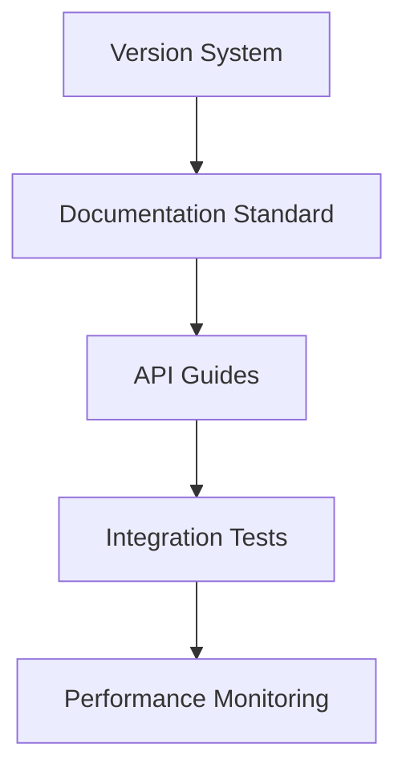

# Next Steps - Unified Backlog

> **Centralized task management** for HEYS project documentation and
> development.
>
> Version: 1.3.0 | Last updated: 2025-08-30

## High Priority

### Documentation Standardization

- [ ] Complete language standardization (EN-core)
- [ ] Finish version placeholder replacement
- [ ] Update all guides with current API references
- [ ] Validate all internal links

### Core System Improvements

- [ ] Implement enhanced error logging diagnostics
- [ ] Complete storage layer optimization
- [ ] Finalize smart search with typos integration
- [ ] Deploy universal anchor automation

### Testing & Quality

- [ ] Add unit tests for DependencyResolver cycles
- [ ] Implement NPS collection automation
- [ ] Set up comprehensive integration tests
- [ ] Create performance benchmarking suite

## Medium Priority

### User Experience

- [ ] Improve navigation maps system
- [ ] Enhance virtual list performance
- [ ] Optimize mobile responsiveness
- [ ] Add accessibility features

### Infrastructure

- [ ] Complete Supabase integration
- [ ] Implement service worker caching
- [ ] Set up monitoring and alerting
- [ ] Create deployment automation

### Developer Experience

- [ ] Create comprehensive API documentation
- [ ] Set up development environment guides
- [ ] Implement code generation tools
- [ ] Add debugging utilities

## Low Priority

### Future Enhancements

- [ ] Explore AI-powered search improvements
- [ ] Investigate advanced analytics
- [ ] Consider internationalization support
- [ ] Plan modular architecture expansion

## Completed ✅

### Recent Achievements

- [x] Set up unified version tracking system
- [x] Created centralized backlog management
- [x] Implemented documentation quality checks
- [x] Established CI/CD pipeline for docs

## Dependencies

## Notes

- Tasks moved from individual plan files to maintain single source of truth
- Priority levels can be adjusted based on business requirements
- Dependencies must be resolved in order to prevent blockers
- All completed tasks should be moved to respective archive sections

---

**Legend:**

- 🔥 Critical/Urgent
- ⚡ Quick wins (< 1 day)
- 🧪 Requires testing
- 📚 Documentation needed
