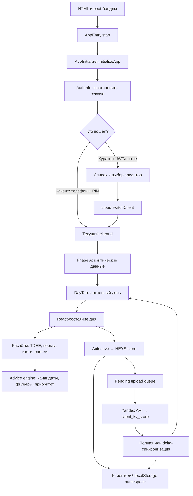

# Как работает HEYS целиком

> Статус: проверено по текущей реализации 18 июля 2026 года. Охват: основной
> web-сценарий — запуск, вход, выбор клиента, дневник, вычисления, локальное
> хранение, облачная синхронизация и рекомендации. Не подтверждено: полный
> browser UX, production-конфигурация и потоки mobile, landing и operational
> backend за пределами основного web-сценария.

## Суть

HEYS устроен как локально-первичное приложение: после определения пользователя и
активного клиента интерфейс читает рабочие данные из локального клиентского
пространства, изменения сразу отражаются на экране и сохраняются локально, а
облачная очередь отправляет их в `client_kv_store` асинхронно. При входе и смене
клиента облако сначала загружает быстрый критический набор данных, разблокирует
интерфейс, затем догружает остальное. Расчёты и советы строятся в браузере из
дневника, профиля, норм, каталога продуктов и истории.

## Главный контур

Главный принцип этого контура: сетевой запрос не стоит между действием
пользователя и обновлением экрана. Сеть отвечает за перенос и восстановление
данных, а не за каждое локальное изменение интерфейса.

## 1. Запуск приложения

Порядок загрузки legacy-runtime задаётся в
[`scripts/legacy-bundle-config.mjs`](../../../scripts/legacy-bundle-config.mjs):
сначала boot/core и расчётные модули, затем модули дня, приложение и финальная
инициализация. Тонкий вход
[`heys_app_v12.js`](../../../apps/web/heys_app_v12.js) вызывает
`HEYS.AppEntry.start()`.

Далее цепочка выглядит так:

1. [`heys_app_entry_v1.js`](../../../apps/web/heys_app_entry_v1.js) выставляет
   локальные feature defaults, при необходимости загружает demo snapshot и
   передаёт `initializeApp` загрузчику зависимостей.
2. [`heys_app_initialize_v1.js`](../../../apps/web/heys_app_initialize_v1.js)
   подключает runtime-модули, создаёт компонент приложения и монтирует React
   через `ReactDOM.createRoot`.
3. Корневой wrapper слушает `heys:client-changed` и меняет React `key` на
   `clientId`. Поэтому после реальной смены клиента всё дерево приложения
   монтируется заново и не продолжает жить со stale-state предыдущего клиента.
4. После успешного mount выставляется `window.__heysAppReady = true`; если
   инициализация не состоялась, входной слой показывает recovery screen.

## 2. Вход и восстановление сессии

Запуск авторизации инициирует
[`useClientInitState`](../../../apps/web/heys_app_client_init_v1.js), а основная
машина восстановления находится в
[`runAuthInit`](../../../apps/web/heys_app_auth_init_v1.js).

| Сценарий   | Как восстанавливается                                          | Что происходит дальше                                                                              |
| ---------- | -------------------------------------------------------------- | -------------------------------------------------------------------------------------------------- |
| Нет сети   | Загружаются локальные продукты, клиенты и последний `clientId` | Приложение продолжает работать с локальными данными; если клиента нет, показывается предупреждение |
| Клиент     | PIN-маркер, session cookie или событие успешного входа         | Cloud получает PIN-контекст, локальный клиент активируется, запускается `syncClient(clientId)`     |
| Куратор    | Сохранённый user, curator JWT или HttpOnly cookie probe        | Проверяется сессия, загружается список клиентов, восстанавливается или запрашивается выбор клиента |
| Сессии нет | `buildGate` видит отсутствие пользователя и клиента            | Показывается React-экран входа клиента или куратора                                                |

При конфликте явный curator JWT имеет приоритет над устаревшим PIN-маркером; без
явного JWT PIN-сессия сохраняет приоритет над legacy-совместимым curator auth.
Транзиентная ошибка сети при восстановлении PIN не стирает локальную сессию и
кэш; auth-state очищается только при ошибке авторизации.

## 3. Выбор и изоляция клиента

Текущий клиент представлен одновременно runtime-значением `HEYS.currentClientId`
и служебным ключом `heys_client_current`. Это не сами данные клиента, а
указатель, который определяет namespace чтения и записи.

Для куратора список синхронизирует
[`useClientListSync`](../../../apps/web/heys_app_client_management_v1.js). Выбор
в gate проходит через
[`cloud.switchClient`](../../../apps/web/heys_storage_supabase_v1.js), после
чего `buildGate` фиксирует выбранный ID и отправляет `heys:client-changed`.

Смена клиента — защищённая транзакция, а не простая замена ID:

1. Ставится `_switchClientInProgress`, останавливаются refresh-задачи и
   сбрасываются привязанные к прежнему клиенту кэши.
2. Pending-очередь прежнего клиента пытается отправиться до переключения.
3. Новый client context активируется и принудительно синхронизируется.
4. `HEYS.store` очищает memory cache, а stale-записи, возникшие во время смены,
   откладываются и затем воспроизводятся в правильном namespace.
5. После завершения React получает `heys:client-changed` и перемонтирует дерево.

Это главный барьер против смешивания дневников, профилей и настроек двух
клиентов.

## 4. Первая загрузка данных

Публичная точка входа — `cloud.syncClient(clientId)`. Она дедуплицирует
параллельные вызовы и обычно делегирует загрузку в `cloud.bootstrapClientSync`;
старый `syncClientViaRPC` остаётся fallback-путём.

Синхронизация разделена на два пользовательски значимых этапа:

| Этап                  | Назначение                                                          | Сигнал интерфейсу                                                     |
| --------------------- | ------------------------------------------------------------------- | --------------------------------------------------------------------- |
| Phase A               | Быстро положить в локальный namespace данные, нужные первым экранам | `heysSyncCompleted` с `phaseA: true`                                  |
| Полная/delta загрузка | Догрузить остальные изменившиеся ключи страницами                   | `heysSyncCompleted` с `phase: 'full'` и предметные события обновления |

Название «Phase A — 5 ключей» осталось в старом комментарии, но фактический
список уже расширен. Помимо профиля, норм, продуктов, HR-зон и сегодняшнего дня
он включает настройки советов, game/subscription state, раскладку виджетов,
пресеты еды и критические planning-данные. Поэтому корректный контракт Phase A —
«критический набор первого отображения», а не фиксированное число пять.

Первый стабильный кадр PIN-клиента открывается только после свежей Phase A или
после подтверждённой runtime-готовности этого же клиента. Persisted
`last_sync_ts` сам по себе больше не снимает loader: он доказывает лишь прошлую
синхронизацию и не гарантирует, что локальный вопрос, шапка или сегодняшний день
совпадают с облаком. При намеренном remount по `heys:client-changed` readiness
сохраняется в sync-runtime по `clientId`, поэтому второй loader не ждёт уже
полученное событие повторно.

Boot-прогресс доходит до 100% и скрывается только после
`heys:app-content-ready`: это событие отправляется эффектом уже после commit
рабочего React-экрана или gate. Сам `root.render()` готовностью не считается,
потому что между его вызовом и первым содержательным кадром возможна пауза.

После успешного PIN форма остаётся в состоянии «Проверяем PIN» до Phase A.
Первая активация `anonymous → client` меняет состояние приложения in-place и не
запускает повторный `AppAuthInit`; защитный remount сохраняется для logout и
реального переключения `client → client`, где требуется очистка дерева.

Версионированное подтверждение обязательных согласий остаётся действующим во
время фоновой серверной перепроверки: такой revalidation не скрывает уже готовый
экран или открытый чек-ин. Явный ответ о недействительных/устаревших согласиях
по-прежнему немедленно возвращает блокирующий legal gate.

Если сеть недоступна, bootstrap помечает sync как завершённый для локального
режима и не блокирует работу. Если перед download уже есть несохранённые
изменения текущего клиента, sync сначала пытается сбросить pending-очередь,
чтобы старое облачное значение не затёрло более новое локальное.

Перед RPC-upload queued/in-flight `dayv2` повторно сверяется с актуальным
client-scoped LS и при отличии проходит общий entity-level merge. Это закрывает
окно, где пользователь меняет поля существующего item после формирования
in-flight batch: старый payload не уходит как окончательная версия, старый ack
не откатывает LS, а появившаяся во время запроса свежая pending-запись остаётся
для следующего upload.

Журнал оценок голода синхронизируется как коллекция событий: серверные
merge-save и legacy batch-пути, а также foreground hot-sync объединяют строки по
`event.id`. Поэтому snapshot из старой вкладки не может удалить оценки, которые
уже появились на другом устройстве; одинаковый ID решается по времени обновления
строки, после чего сохраняется свежий хвост в пределах storage budget.
Пользовательские Hunger-события проходят 10-секундное post-sync grace-окно: для
append-only журнала mirror-loop уже предотвращает merge по `event.id`, а потеря
acknowledgement иначе повторно открывает вопрос по тому же приёму.

История обратной связи инсайтов (`heys_insights_feedback`) тоже является
ограниченным append/update log: все write- и hot-sync пути делают union по
`record.id`, сохраняют более позднее обогащение результата и только затем
обрезают историю до 30 последних рекомендаций. Удаление ID из stale snapshot не
трактуется как пользовательское удаление.

## 5. Открытие дневника

[`DayTabWithCloudSync`](../../../apps/web/heys_app_tabs_v1.js) — адаптер между
приложением, синхронизацией и дневником. Он допускает быстрый показ после Phase
A, не ждёт весь хвост синхронизации и имеет fallback на локальные данные. Сам
`DayTab` получает React `key`, зависящий от клиента и выбранной даты, поэтому
смена даты создаёт новое состояние дня.

Рабочее состояние создаёт [`DayTab`](../../../apps/web/heys_day_tab_impl_v1.js):

- начальное значение берётся через
  [`getInitialDay`](../../../apps/web/heys_day_init_v1.js) из клиентского
  `heys_dayv2_YYYY-MM-DD`; при отсутствии записи создаётся пустая форма дня;
- [`useDaySyncEffects`](../../../apps/web/heys_day_effects.js) гидратирует дату,
  применяет cloud-обновления и не даёт более старому снимку заменить более
  свежий;
- обычное создание приёма через
  [`day/_meals.js`](../../../apps/web/day/_meals.js) сначала показывает
  визуальный ориентир тарелки со случайным вариантом без немедленного повтора;
  следующий вариант резервируется после загрузки приложения и в idle-периоде
  прогревается через `Image.decode()`, но фоновая загрузка отключается при
  `Save-Data` и соединении 2G; сам приём создаётся только после основного
  действия, тогда как shortcut/share-target передают `skipPlateGuide` и
  сохраняют прямой вход в существующий сценарий;
- перед сменой даты запрашивается принудительный flush предыдущего дня;
- autosave не включается, пока день не гидратирован, чтобы пустой начальный
  state не перезаписал сохранённые данные.

Основная единица дневника — один объект дня: приёмы пищи, тренировки, вода,
шаги, сон, вес, самочувствие, бытовая активность, настройки цели и служебные
метаданные записи. Детальные контракты отдельных полей должны жить в досье
данных, а здесь важна принадлежность всего объекта дате и клиенту.

## 6. Что происходит при изменении дневника

Пользовательское действие сначала меняет React-state `day`. Затем
[`useDayAutosave`](../../../apps/web/heys_day_hooks.js) с debounce сохраняет
снимок по ключу дня.

Перед записью autosave:

- проверяет, что сохраняемая дата совпадает с открытой;
- не позволяет более старому snapshot заменить новый;
- защищает содержательный день от случайной записи пустой формы;
- добавляет `schemaVersion`, `updatedAt` и `_sourceId`;
- ограничивает попадание тяжёлого base64-фото в локальное хранилище;
- отправляет `heys:data-saved` и межвкладочное уведомление после flush.

Таким образом, «день на экране» и «последний сохранённый день» — два состояния,
связанные контролируемым autosave, а не прямыми записями каждого input в облако.

## 7. Расчёты

Расчёты выполняются в браузере и пересчитываются при изменении входных данных. В
главном дневниковом контуре есть четыре уровня:

| Уровень      | Входы                                               | Результат                                                      | Реализация                                                                                      |
| ------------ | --------------------------------------------------- | -------------------------------------------------------------- | ----------------------------------------------------------------------------------------------- |
| Энергия      | День, профиль, активности, питание                  | BMR, тренировки, шаги, TEF, TDEE, optimum, фактический дефицит | [`buildEnergyContext`](../../../apps/web/heys_day_energy_context_v1.js) → `HEYS.TDEE.calculate` |
| Питание      | Meals и индекс продуктов                            | Калории, Б/Ж/У, виды углеводов и жиров, клетчатка, GI, harm    | [`calculateDayTotals`](../../../apps/web/heys_day_calculations.js)                              |
| Нормы        | `optimum` и процентные нормы                        | Абсолютные дневные цели по нутриентам                          | [`computeDailyNorms`](../../../apps/web/heys_day_calculations.js)                               |
| Самочувствие | Утренний check-in, оценки еды и реальных тренировок | Средние mood/wellbeing/stress и `dayScore`                     | [`calculateDayAverages`](../../../apps/web/heys_day_calculations.js)                            |

[`buildNutritionState`](../../../apps/web/heys_day_nutrition_state_v1.js)
соединяет totals, нормы и view-model таблицы питания. Результаты вычислений
передаются дальше в карточки дневника и в advice engine; они не требуют
отдельного сетевого round-trip.

## 8. Локальное хранение

Основной фасад — [`HEYS.store`](../../../apps/web/heys_storage_layer_v1.js).
`Store.get` добавляет client scope, использует memory cache и умеет
восстанавливать некоторые legacy-ключи. `Store.set`:

1. вычисляет scoped key вида `heys_<clientId>_<tail>`;
2. обновляет memory cache и `localStorage`;
3. уведомляет локальных watchers;
4. для клиентских данных вызывает
   `HEYS.saveClientKey(clientId, scopedKey, value)`.

Глобальные ключи — например, список клиентов и указатель текущего клиента — не
отправляются как данные выбранного клиента. Во время `switchClient` обычные
записи блокируются или откладываются, чтобы React-state старого клиента не попал
в namespace нового.

### Кто чем владеет

| Сущность                               | Рабочий владелец                 | Долговременная копия                        |
| -------------------------------------- | -------------------------------- | ------------------------------------------- |
| Открытый день                          | React-state `DayTab`             | Scoped `heys_dayv2_<date>` + cloud KV       |
| Активный клиент                        | App/client state                 | `heys_client_current` и last-client markers |
| Профиль, нормы, настройки              | `HEYS.store` и профильные модули | Scoped localStorage + cloud KV              |
| Pending-записи                         | Sync runtime                     | Персистентная очередь до успешной отправки  |
| Вычисляемые totals/TDEE/advice context | Память текущего render           | Восстанавливаются из исходных данных        |

## 9. Отправка в облако и получение обновлений

`cloud.saveClientKey` нормализует запись и ставит её в pending-очередь.
`scheduleClientPush` объединяет частые изменения, а uploader отправляет batch
через Yandex API в `client_kv_store`. Последнее значение одного ключа в batch
побеждает; при offline или временной ошибке данные остаются локально и
возвращаются в очередь на retry. Повторы идут с exponential backoff и
останавливаются после исчерпания retry-бюджета; circuit breaker не удаляет
pending-запись и возобновляется после восстановления сессии или сети.

Все HTTP-попытки `HEYS.YandexAPI` проходят через общий приоритетный диспетчер:
одна вкладка держит не больше трёх активных запросов, а Phase A, авторизация и
записи обходят фоновую очередь. Сетевые ошибки и ответы `429/502/503/504`
открывают единый backoff для всей очереди; `429` учитывает `Retry-After`,
поэтому независимые модули не повторяют запросы одновременно. Первый успешный
ответ после такого перерыва отправляет `heys:api-recovered`, и sync повторно
забирает критические ключи даже если `navigator.onLine` всё время оставался
`true`.

Серверный контур rpc/rest использует общий capacity policy: production-версия
должна иметь `concurrency=4`, scaling limits `40/40` на зону, а handler guard не
создаёт искусственный предел ниже runtime и возвращает управляемый `429` с
`Retry-After`, если вызов всё же превысил admission limit. Pre-deploy gate
отдельно проверяет live cloud-квоты: target peak 20 запросов (шесть клиентов с
Phase A + uploads и два canary), обязательный запас — 40. Это не меняет pending,
merge или `dayv2` payload: перегруженный upload остаётся тем же запросом для
последующего retry на клиенте.

Для `dayv2.morningActivation` корневой `updatedAt` дня не считается достаточным
сигналом свежести: terminal-решения `done`/`missed`, выбранная причина и явная
очистка сравниваются по времени самого действия. Поэтому частичный снимок из
другой вкладки, содержащий только `copyId`, не может стереть уже сохранённый
статус или причину, а более новая явная очистка остаётся допустимой.

Перед каждой отправкой uploader получает действующий write-context текущей
сессии. Сохранённый в pending-записи `_ctx` может относиться к прошлой сессии,
поэтому актуальный live-context всегда имеет приоритет; без него обязательная
context-запись остаётся локально, а не уходит с заведомо недействительным
токеном.

Пошаговые действия утреннего чек-ина подтверждаются после успешной локальной
записи и не ждут очистки всей облачной очереди. Обычный uploader продолжает
синхронизацию в фоне; недоступность сети не блокирует переход между шагами или
завершение уже сохранённого чек-ина. Один пользовательский переход создаёт одну
терминальную запись шага в журнале; повторное нажатие во время сохранения не
запускает второй save или повторное завершение flow.

Автоматический план чек-ина строится только после полного initial download
активного клиента: готовность согласий и быстрая Phase A сами по себе его не
открывают, потому что проверка прошлых дней зависит от исторических `dayv2`.
Перед финальным session-флагом решение `YesterdayVerify` сверяется повторно;
новая обязательная проверка возвращает журнал в `open`, а опустошение общей
pending-очереди переводит локально сохранённые строки журнала в `synced`.

Журнал утреннего чек-ина сверяет старый `planned` для `yesterdayVerify` с
актуальным решением готового модуля проверки: уже закрытое решение не становится
невидимой финальной блокировкой, а неготовый модуль и реальные пропуски остаются
fail-closed.

Download использует полную или delta-загрузку. Полученные ключи проходят
проверки client ownership, pending-local guard и специальные anti-wipe правила.
Progress ledger утреннего чек-ина во всех входящих путях, включая foreground
hot-sync, объединяется по строкам шагов: старый cloud snapshot не может вернуть
локальный `saved_local`/`synced` в `planned`. После записи в localStorage слой
sync очищает соответствующий memory cache и отправляет предметные события:
например, `heys:day-updated` для дней и `heys:products-updated` для каталога.

Важно различать два события:

- `heysSyncCompleted` означает завершение этапа download/initial sync;
- `heys:data-uploaded` означает, что локальные изменения действительно ушли в
  облако.

## 10. Как появляются рекомендации

[`useAdviceIntegration`](../../../apps/web/heys_day_advice_integration_v1.js)
передаёт в advice-state сам день, профиль, totals, абсолютные нормы, optimum,
water goal, streak, продукты и UI-state. Текущая реализация state-hook находится
в [`heys_day_bundle_v1.js`](../../../apps/web/heys_day_bundle_v1.js), а правила
и движок — в
[`heys_advice_bundle_v1.js`](../../../apps/web/heys_advice_bundle_v1.js).

Advice engine работает как детерминированный pipeline:

1. строит контекст дня: время, количество приёмов пищи, тренировку, выполнение
   калорий, goal mode, эмоциональное состояние и доступные risk-сигналы;
2. собирает кандидатов из модульных правил, цепочек, отложенных советов,
   goal-specific правил и personal bests;
3. применяет настройки категорий, goal boost, mood adaptation, trigger,
   smart-score, разрешение конфликтов, временные ограничения, deduplication,
   excludes и лимиты категорий;
4. отдельно проверяет cooldown для автоматического toast;
5. возвращает `primary`, полный список релевантных советов, badge-набор и trace,
   объясняющий прохождение фильтров.

Совет пересчитывается только при изменении реального engine input, а не при
любом локальном UI-render. Настройки показа, прочитанные и скрытые советы также
хранятся в client scope и входят в быстрый sync-набор.

## 11. Поведение при сбоях

| Сбой                                  | Ожидаемое поведение                                                                                            |
| ------------------------------------- | -------------------------------------------------------------------------------------------------------------- |
| Сеть недоступна при старте            | Используется локальный клиент и кэш; сохранения продолжаются локально                                          |
| Upload временно не удался             | Запись возвращается в pending-очередь и повторяется с backoff; после лимита circuit breaker останавливает цикл |
| Pending хранит контекст старой сессии | Перед retry запись перепривязывается к live write-context; локальные данные не удаляются                       |
| Авторизация истекла                   | Бессмысленный retry останавливается до новой сессии; локальные данные не выбрасываются автоматически           |
| Phase A не удалась                    | UI использует локальный fallback; API recovery запускает повторный pull критических ключей                     |
| Пришёл старый день из cloud           | Guards сравнивают ownership, pending-status и timestamps; более свежая локальная запись не должна быть затёрта |
| Клиент меняется во время debounce     | Запись откладывается и воспроизводится в namespace исходного клиента                                           |
| Advice-модуль ещё не загружен         | Day state ждёт модуль ограниченное время и использует пустой безопасный результат                              |

## 12. Где продолжать изучение

- Порядок runtime-модулей:
  [`scripts/legacy-bundle-config.mjs`](../../../scripts/legacy-bundle-config.mjs)
- Стабильные web-инварианты:
  [`apps/web/ARCHITECTURE.md`](../../../apps/web/ARCHITECTURE.md)
- Подробности старого sync-описания:
  [`docs/SYNC_REFERENCE.md`](../../SYNC_REFERENCE.md) — использовать только
  после сверки с кодом
- Следующие досье: [список систем](README.md)

## Facts Table

Таблица фиксирует не просто ссылки, а прямые проверки утверждений, на которых
держится схема выше.

| Утверждение                                                                  | Проверка                                                                                                                                                                                                                            | Результат                                                                                       |
| ---------------------------------------------------------------------------- | ----------------------------------------------------------------------------------------------------------------------------------------------------------------------------------------------------------------------------------- | ----------------------------------------------------------------------------------------------- |
| Runtime входит через `AppEntry.start`, затем `initializeApp`                 | `rg -n "AppEntry.start\|initializeApp" apps/web/heys_app_v12.js apps/web/heys_app_entry_v1.js apps/web/heys_app_initialize_v1.js`                                                                                                   | Подтверждена цепочка входа и инициализации                                                      |
| React root меняет key по `heys:client-changed`                               | `rg -n "createRoot\|heys:client-changed\|key: reactKey" apps/web/heys_app_initialize_v1.js`                                                                                                                                         | Подтверждены mount и client-key remount                                                         |
| Auth-init поддерживает local/offline, PIN и curator restore                  | `rg -n "initLocalData\|setPinAuthClient\|verifyCuratorToken\|getCurrentClientBySession" apps/web/heys_app_auth_init_v1.js`                                                                                                          | Подтверждены все три ветви                                                                      |
| Gate вызывает защищённый `switchClient`                                      | `rg -n "buildGate\|switchClient" apps/web/heys_app_gate_flow_v1.js apps/web/heys_storage_supabase_v1.js`                                                                                                                            | Подтверждены UI-вход и cloud-транзакция                                                         |
| Phase A разблокирует UI отдельным событием                                   | `sed -n '7760,7950p' apps/web/heys_storage_supabase_v1.js`                                                                                                                                                                          | Подтверждены расширенный список и `phaseA: true`                                                |
| Phase A фактически больше пяти ключей                                        | `sed -n '7810,7875p' apps/web/heys_storage_supabase_v1.js`                                                                                                                                                                          | Подтверждены дополнительные advice, game, subscription, widget, preset и planning keys          |
| Day adapter допускает Phase A и локальный fallback                           | `sed -n '133,285p' apps/web/heys_app_tabs_v1.js`                                                                                                                                                                                    | Подтверждены Phase A unlock и fallback render                                                   |
| День инициализируется из scoped dayv2 и не autosave-ится до hydration        | `rg -n "getInitialDay\|useDayAutosave\|disabled: !isHydrated" apps/web/heys_day_init_v1.js apps/web/heys_day_tab_impl_v1.js`                                                                                                        | Подтверждено                                                                                    |
| Autosave ставит metadata и отправляет `heys:data-saved`                      | `rg -n "schemaVersion\|updatedAt\|_sourceId\|heys:data-saved" apps/web/heys_day_hooks.js`                                                                                                                                           | Подтверждено                                                                                    |
| Totals, нормы и dayScore вычисляются локально                                | `rg -n "calculateDayTotals\|computeDailyNorms\|calculateDayAverages" apps/web/heys_day_calculations.js`                                                                                                                             | Подтверждены три чистых расчётных входа                                                         |
| TDEE-контекст вызывает `HEYS.TDEE.calculate`                                 | `rg -n "TDEE.*calculate\|buildEnergyContext" apps/web/heys_day_energy_context_v1.js`                                                                                                                                                | Подтверждено                                                                                    |
| `Store.set` пишет local state и передаёт клиентские ключи в `saveClientKey`  | `sed -n '654,782p' apps/web/heys_storage_layer_v1.js`                                                                                                                                                                               | Подтверждены scoping, local write, watchers и cloud handoff                                     |
| Upload использует pending-очередь и Yandex RPC                               | `rg -n "enqueueClientSave\|scheduleClientPush\|saveClientViaRPC" apps/web/heys_storage_supabase_v1.js`                                                                                                                              | Подтверждены enqueue, batch scheduler и отправка                                                |
| API ограничивает fan-out и централизует transient backoff                    | `rg -n "REQUEST_MAX_CONCURRENCY\|openRequestBackoff\|scheduleRequestAttempt" apps/web/heys_yandex_api_v1.js`                                                                                                                        | Не больше трёх HTTP-попыток на вкладку; 429 и network failure тормозят всю очередь              |
| Реальный API recovery повторяет sync без browser online event                | `rg -n "heys:api-recovered\|requestForegroundAutoSync\('api-recovered'" apps/web/heys_yandex_api_v1.js apps/web/heys_storage_supabase_v1.js`                                                                                        | Успешный probe возвращает критические cloud-ключи в активный клиент                             |
| Serverless capacity требует 2× cloud-headroom и даёт управляемый Retry-After | `node yandex-cloud-functions/check-serverless-capacity.cjs --strict && node --test yandex-cloud-functions/__tests__/serverless-capacity-policy.test.cjs yandex-cloud-functions/shared/__tests__/serverless-capacity-guard.test.cjs` | Target 20; request/workers quotas и rpc/rest scaling limits — 40 на зону; runtime concurrency 4 |
| Outbound dayv2 перед RPC сверяется с актуальным LS                           | `rg -n "rehydrateDayv2UploadItemFromLocal\|DAYV2_OUTGOING_" apps/web/heys_storage_supabase_v1.js`                                                                                                                                   | Подтверждены entity-level merge, noop и fail-closed                                             |
| Download и upload имеют разные события                                       | `rg -n "heysSyncCompleted\|heys:data-uploaded" apps/web/heys_storage_supabase_v1.js`                                                                                                                                                | Подтверждено                                                                                    |
| Background consent revalidation не скрывает валидный экран                   | `rg -n "isConsentRevalidationBlocking\|_consentsValid" apps/web/heys_app_derived_state_v1.js apps/web/heys_app_root_impl_v1.js`                                                                                                     | Подтверждён version-bound non-blocking revalidation                                             |
| Foreground hot-sync монотонно объединяет progress ledger                     | `rg -n "mergeMorningCheckinInboundValue\|applyForegroundHotSyncValue" apps/web/heys_storage_supabase_v1.js`                                                                                                                         | Подтверждён step-level merge до записи в localStorage                                           |
| Day передаёт totals/norms/profile в advice engine                            | `sed -n '1700,1765p' apps/web/heys_day_tab_impl_v1.js`                                                                                                                                                                              | Подтверждена интеграция                                                                         |
| Advice pipeline генерирует, фильтрует, приоритизирует и возвращает trace     | `sed -n '8199,8735p' apps/web/heys_advice_bundle_v1.js`                                                                                                                                                                             | Подтверждены context, candidate sources, filters, cooldown, outputs и trace                     |
